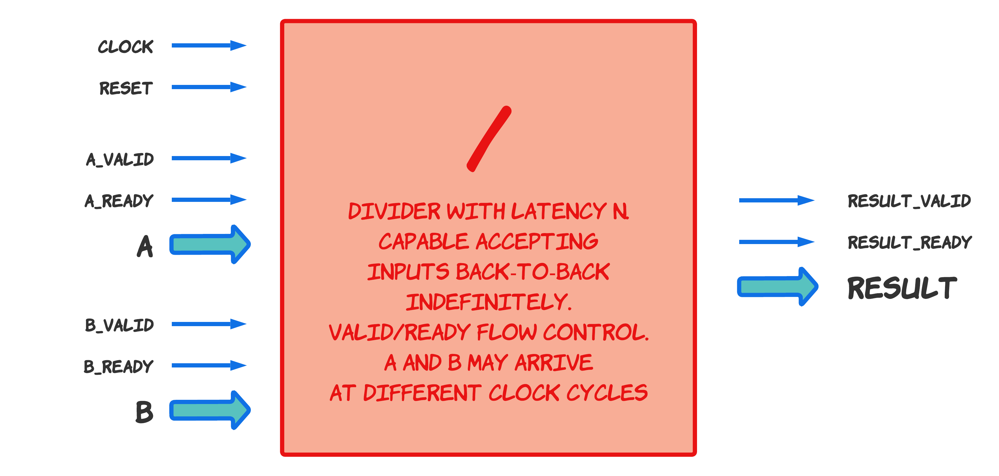

© Yuri Panchul [https://verilog-meetup.com](https://verilog-meetup.com/)

## Question 1. A/B/C out of pipelined A/B

© Yuri Panchul [https://verilog-meetup.com](https://verilog-meetup.com/)

## Question 2. A/B with back-to-back bandwidth out of non-pipelined A/B

© Yuri Panchul [https://verilog-meetup.com](https://verilog-meetup.com/)

## Question 3. A/B/C with backpressure

© Yuri Panchul [https://verilog-meetup.com](https://verilog-meetup.com/)

## Question 4. A/B with separate flow control for A and B

© Yuri Panchul [https://verilog-meetup.com](https://verilog-meetup.com/)

## Question 5.

© Yuri Panchul [https://verilog-meetup.com](https://verilog-meetup.com/)

## Question 6.

© Yuri Panchul [https://verilog-meetup.com](https://verilog-meetup.com/)

## Question 7.

© Yuri Panchul [https://verilog-meetup.com](https://verilog-meetup.com/)

## Question 8.

© Yuri Panchul [https://verilog-meetup.com](https://verilog-meetup.com/)

## Question 4. A/B with separate flow control for A and B

© Yuri Panchul [https://verilog-meetup.com](https://verilog-meetup.com/)

## Question 4. A/B with separate flow control for A and B

© Yuri Panchul [https://verilog-meetup.com](https://verilog-meetup.com/)

## Question 4. A/B with separate flow control for A and B

© Yuri Panchul [https://verilog-meetup.com](https://verilog-meetup.com/)

## Question 4. A/B with separate flow control for A and B

© Yuri Panchul [https://verilog-meetup.com](https://verilog-meetup.com/)

## Question 4. A/B with separate flow control for A and B

© Yuri Panchul [https://verilog-meetup.com](https://verilog-meetup.com/)

## Question 4. A/B with separate flow control for A and B

© Yuri Panchul [https://verilog-meetup.com](https://verilog-meetup.com/)

## Question 4. A/B with separate flow control for A and B
